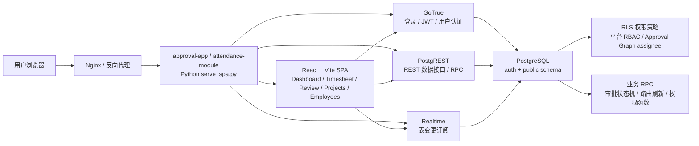
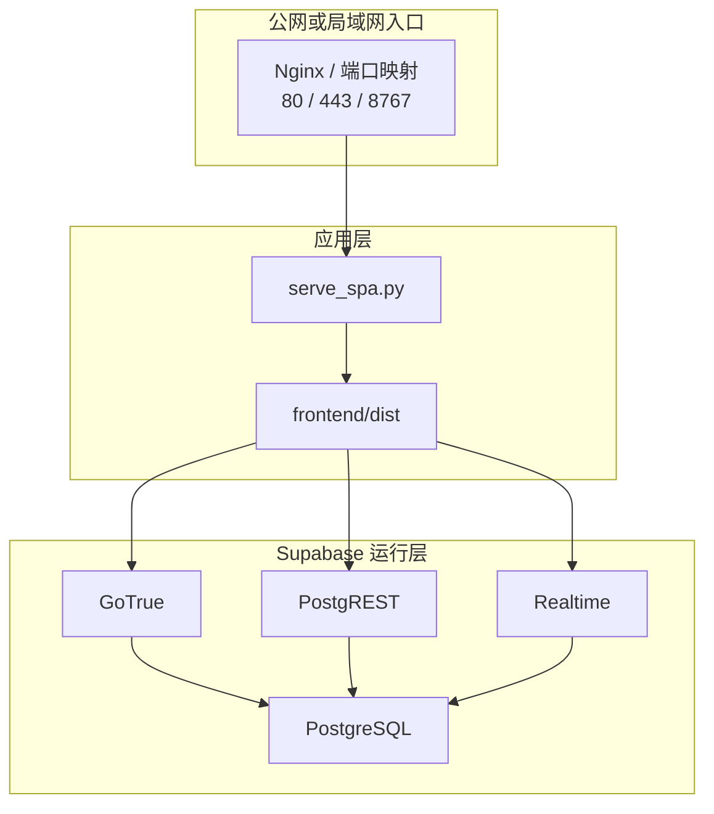
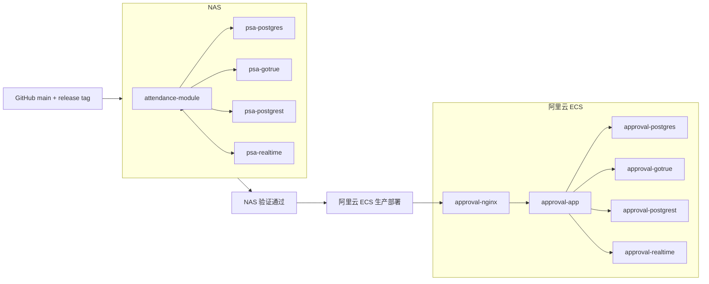
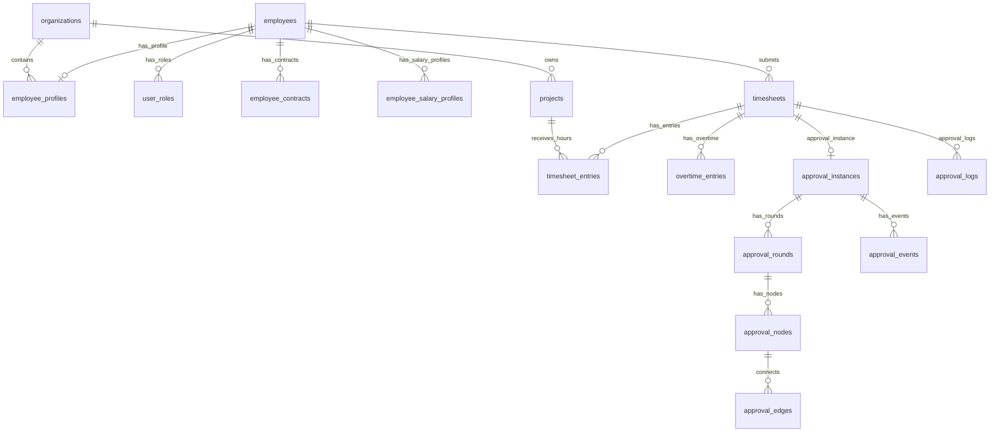
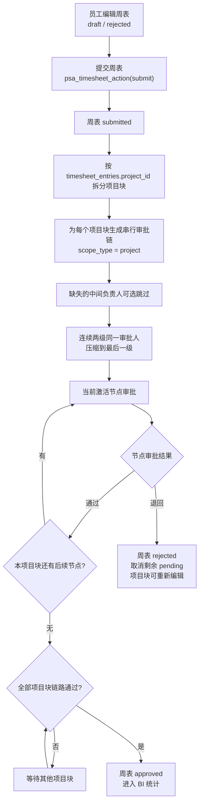
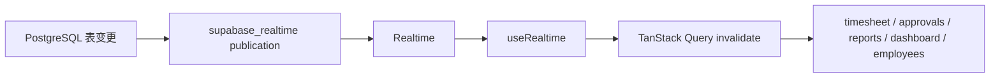

# 项目核算自动化系统 PRD V0.15.1

更新日期：2026-06-13

本文用于描述当前系统真实架构、业务规则、部署状态、已知边界和后续优化议题。目标读者包括产品决策者、开发 Agent、外部推理模型和未来接手维护人员。

> 重要说明：根目录 `PRD.md` 保留为历史版本。本文是当前主参考文档。

## 1. 产品目标

建设内部项目成本管理、工时填报、审批流转和 BI 分析系统，统一管理员工周表、项目工日、组织架构、项目负责人、部门负责人、合同回款、人力成本和审批记录。OT/加班能力保留为预留模块，当前公司业务口径不启用 OT 填报。

当前版本核心目标：

- 员工按周提交项目工时，周日如实际上班按普通工日填写。
- 项目负责人按项目块审批自己负责项目的工时。
- 部门负责人对本部门人员的完整周表进行最终汇总审批。
- 管理员维护员工、组织、项目、账号、审批和基础数据。
- 项目支持 PM、CC、PMCC 服务类型，用于合同审批和负责人配置。
- BI 从项目、部门、人员三个视角分析活跃项目数、投入工日、人力成本。
- 系统可在 NAS 局域网和阿里云 ECS 上部署运行。

当前版本已经从旧业务后端迁移到 Supabase 风格运行态，不再使用 FastAPI、Flask、SQLite、本地文件数据库或旧 WebSocket 同步作为主要运行时。

## 2. 当前版本状态

| 项 | 当前状态 |
| --- | --- |
| 当前版本 | `V0.15.1` |
| 基线版本 | `V0.15` |
| 前端 | React 19 + TypeScript + Vite 8 |
| UI | Tailwind CSS v4 + shadcn/ui 风格组件 + Lucide React |
| 图表 | Recharts |
| 状态管理 | Zustand + TanStack Query |
| 认证 | Supabase GoTrue |
| 数据库 | PostgreSQL 16 + public/auth schema |
| 数据访问 | PostgREST + RPC |
| 实时能力 | Supabase Realtime + BroadcastChannel fallback |
| 静态服务 | `serve_spa.py` 托管 `frontend/dist` 并提供受控 API/代理 |
| 版本显示 | Vite 构建时自动从 Git release tag 推导，显式环境变量可覆盖 |
| NAS 部署 | 局域网容器栈 |
| 云端部署 | 阿里云 ECS，Nginx 反向代理，`approval-app` 镜像随 release tag 构建 |

## 3. 系统总架构



### 3.1 运行组件



### 3.2 NAS 与阿里云部署



部署原则：

- NAS 是当前测试环境，先接收云端数据库备份/恢复并部署候选镜像。
- NAS 冒烟与关键业务验证通过后，才推 GitHub release 并更新阿里云生产环境。
- 公网只暴露 Nginx 的 80/443 和 SSH。
- Postgres、PostgREST、GoTrue、Realtime 不直接暴露公网。
- 数据库使用宿主机持久化目录。
- 生产环境变量存放在部署环境，不提交 Git。
- 云端上线前使用 IP 和 HTTP 预验证，域名解析完成后再切换 HTTPS。
- 数据库函数、视图、RLS 或 RPC 变更后必须触发 PostgREST schema cache reload；无法确认 reload 时重启 PostgREST。

## 4. 用户角色与权限口径

平台权限角色只控制系统页面和功能访问，不参与审批流路由。审批流中的项目负责人、部门负责人、专业负责人来自 `project_roles`、`organizations.manager_user_id`、`approval_node_assignees` 等业务身份配置。

| 平台角色 | 默认能力 |
| --- | --- |
| 员工 | 登录、填写本人周表、保存草稿、提交审批、查看本人数据 |
| 基层负责人 | 默认可进入审批中心、查看基础看板和项目列表 |
| 主管 | 默认可维护系统管理、项目列表，并处理被路由给自己的审批任务 |
| 董事 | 默认可查看经营看板、审批中心、系统管理 |
| 管理员 | 全局员工、组织、项目、审批、BI、账号、数据维护 |

权限来源：

- 平台角色来自 `user_roles.role`，当前取值为 `employee`、`lead`、`manager`、`director`、`admin`。
- 资源权限来自 `permission_roles`、`permission_resources`、`role_permissions`，权限级别为 `不可见 / 只读 / 编辑`。
- 权限配置保存通过 `/api/permissions/save` 调用 `psa_save_role_permission()` RPC；禁止前端绕过 RPC 直接写 `role_permissions`。
- 默认权限迁移只插入缺失项，不覆盖已配置权限，避免重新执行迁移时把运营配置重置。
- 部门负责人来自 `organizations.manager_user_id`。
- 员工所属部门来自 `employee_profiles.org_id`。
- 成本合约执行人员/项目负责人专业来自 `employee_profiles.cost_specialty`，当前取值为 `civil`（土建）或 `mep`（机电）；成本合约部门负责人不需要设置专业。

### 4.1 员工与组织页权限

`/employees` 下设两个并列页：

| 子页 | 资源键 | 说明 |
| --- | --- | --- |
| 系统管理 | `system_management` | 员工列表、部门列表、组织负责人维护 |
| 权限配置 | `permission_config` | 左侧权限角色列表，右侧配置各侧边栏/员工组织资源的可见、只读、编辑权限 |

资源权限控制页面入口和前端操作能力；后端/RLS/RPC 继续使用 `current_user_can_access_resource()` 与 `current_user_can_review()` 做服务端校验。

## 5. 前端页面范围

| 页面 | 路由 | 说明 |
| --- | --- | --- |
| 登录页 | 未登录默认 | 登录、修改密码、密码明文切换 |
| 我的周表 | `/timesheet` | 员工填写项目工时；OT 行预留但当前锁定 |
| 请假申请 | `/leave` | 受资源权限控制的请假功能入口；当前为占位页，暂不接后端接口 |
| 数据看板 | `/dashboard` | 指标卡、项目汇总、BI 项目/部门/人员视角 |
| 审批中心 | `/review` | 待审核、已审核、周表详情；admin 可维护合同审批模板并实时预览流程图；OT 审批能力保留但当前业务不启用 |
| 项目列表 | `/report` | 左侧项目目录、右侧固定配置页；维护项目编码、服务类型、项目名称、PM/CC/PMCC 负责人、财务与工时统计 |
| 员工与组织 | `/employees` | 系统管理与权限配置并列；员工资料、合同薪酬、组织结构、部门负责人、平台权限矩阵 |
| 应用中心 | `/apps` | 受资源权限控制的应用入口；当前为占位页，暂不接后端接口；在侧边栏菜单顺序中排最后 |

### 5.1 前端组件结构

```text
frontend/src/
  App.tsx
  pages/
    DashboardPage.tsx
    ReviewPage.tsx
    TimesheetPage.tsx
    LeavePage.tsx
    ReportPage.tsx
    EmployeesPage.tsx
    AppsPage.tsx
  components/
    dashboard/
      MetricCards.tsx
      DashboardTable.tsx
      PeriodFilter.tsx
      BiPerspectiveTab.tsx
    review/
    timesheet/
    report/
    employees/
    layout/
      LoginScreen.tsx
      Sidebar.tsx
      Topbar.tsx
  lib/
    api.ts
  stores/
    authStore.ts
    appStore.ts
```

## 6. API 与服务端口径

前端仍保留 `api("/api/...")` 形式作为兼容层，实际由 `frontend/src/lib/api.ts` 分流到 GoTrue、PostgREST、RPC 或 `serve_spa.py` 受控端点。

| 前端路径 | 实际实现 | 说明 |
| --- | --- | --- |
| `POST /api/login` | GoTrue password grant | 支持登录名、姓名、员工编号、邮箱解析 |
| `POST /api/logout` | 前端清理 token | 纯前端退出 |
| `POST /api/password/change` | `serve_spa.py` 受控端点 | 支持登录页和已登录改密 |
| `GET /api/me` | PostgREST | 根据 JWT 找当前员工 |
| `GET /api/bootstrap` | PostgREST 并行查询 | 当前用户、项目、基础数据 |
| `GET /api/timesheet` | PostgREST 平铺查询 | 周表、明细、加班 |
| `POST /api/timesheet/save` | PostgREST 写入 | 草稿/退回状态保存 |
| `POST /api/timesheet/action` | `psa_timesheet_action` RPC | 周表提交、审批、退回、重开 |
| `GET /api/timesheet-detail` | PostgREST 平铺查询 | 审批详情页周表明细 |
| `POST /api/overtime/action` | `psa_overtime_action` RPC | OT 预留审批接口，当前 UI 不开放填报 |
| `GET /api/overtime/pending` | `approvalTasks` 派生 | OT 预留待办 |
| `GET /api/approvals/tasks` | PostgREST 平铺查询 | 待审核/已审核 |
| `GET /api/approval-templates` | PostgREST 平铺查询 | 合同审批模板、节点、边 |
| `POST /api/approval-templates/save` | PostgREST 更新 | admin 保存模板名称、版本、节点配置 |
| `GET /api/permissions` | PostgREST 聚合 | 读取平台角色、资源列表、角色权限矩阵 |
| `POST /api/permissions/save` | `psa_save_role_permission` RPC | 保存单个角色-资源权限；返回结构化错误，避免前端显示 `{}` |
| `GET /api/employees` | `hr_employee_current_view` + 角色表 | 员工列表与角色 |
| `POST /api/employees/save` | 新增走服务端，编辑走 PostgREST | 新增员工需要创建 GoTrue 账号 |
| `POST /api/employees/delete` | PostgREST 软删除 | 停用员工并标记档案离职 |
| `GET /api/organizations` | PostgREST 聚合 | 组织树与负责人 |
| `POST /api/organizations/save` | PostgREST upsert | 新增/编辑组织 |
| `POST /api/organizations/delete` | PostgREST 软删除 | 标记组织删除 |
| `GET /api/projects` | PostgREST 聚合 | 项目列表、人力投入、负责人 |
| `POST /api/projects/save` | PostgREST upsert + 路由刷新 | 项目、服务类型、负责人、部门负责人配置；CC 土建/机电负责人同步兼容 `cc_project_owner` |
| `POST /api/project-department-owners/save` | PostgREST upsert | 项目-部门负责人配置 |
| `POST /api/projects/delete` | PostgREST 软删除 | 标记项目删除 |
| `GET /api/reports/weekly` | PostgREST + JS 聚合 | 周/月/区间统计 |
| `GET /api/reports/labor-matrix` | PostgREST + JS 聚合 | 项目 × 月份投入矩阵 |
| `GET /api/project-detail` | PostgREST + JS 聚合 | 项目人员投入明细 |

当前无后端接口的页面：

| 页面 | 路由 | 接口口径 |
| --- | --- | --- |
| 请假申请 | `/leave` | 当前仅前端占位入口，侧边栏和页面访问由 `leave` 资源权限控制；后续请假申请、余额、审批规则确认后再新增 `/api/leave/*` 或 RPC |
| 应用中心 | `/apps` | 当前仅前端占位入口，侧边栏和页面访问由 `apps` 资源权限控制；后续应用清单、权限配置确认后再新增接口 |

服务端受控端点：

| 端点 | 方法 | 用途 |
| --- | --- | --- |
| `/api/create-employee-with-login` | POST | 管理员新增员工并创建 GoTrue 用户 |
| `/api/change-password` | POST | 修改密码并清除首次改密标记 |
| `/auth/*` | 任意 | 同源代理到 GoTrue |
| `/rest/*` | 任意 | 同源代理到 PostgREST |

安全约束：

- `service_role`、`JWT_SECRET`、数据库密码、NAS 密码不得进入前端。
- 生产默认初始密码由环境变量控制，不在 PRD 明文记录。
- GoTrue signup 禁用，新账号由受控流程创建。

## 7. 核心数据模型



核心 public schema：

| 表/视图 | 用途 |
| --- | --- |
| `profiles` | 登录名、GoTrue 邮箱、auth UUID 映射 |
| `employees` | 员工主表 |
| `employee_profiles` | 员工组织、岗位、直属负责人、在职状态 |
| `employee_contracts` | 合同档案 |
| `employee_salary_profiles` | 薪酬档案 |
| `user_roles` | 员工角色 |
| `organizations` | 组织架构与部门负责人 |
| `projects` | 项目基础信息、项目负责人、项目所属部门 |
| `project_department_owners` | 项目-部门负责人映射，支持多参与部门 |
| `project_roles` | 项目角色配置，支持 PM/CC/PMCC 负责人 |
| `timesheets` | 周表主表 |
| `timesheet_entries` | 周表项目明细 |
| `overtime_entries` | 加班记录 |
| `workflow_tasks` | V0.15 已废弃并 Drop；历史任务在迁移时归一化到 Approval Graph |
| `approval_logs` | 审批日志 |
| `approval_instances` | Adaptive Approval Graph 单据实例 |
| `approval_rounds` | 审批轮次 |
| `approval_nodes` | 审批节点 |
| `approval_edges` | 节点依赖 |
| `approval_events` | 审批事件 |
| `hr_employee_current_view` | 员工当前档案视图 |

## 8. 周表与审批规则

### 8.1 周表基础规则

- 每名员工每周只能有一张周表。
- 每天所有项目工日合计不得超过 1 工日。
- 每周普通工日最多 7 工日；周日上班按普通工日处理，不走 OT。
- 项目行/项目块合计显示 2 位小数，避免个位数百分比在审批时被 0.1 工日展示精度掩盖。
- 周表状态主线：`draft -> submitted -> approved/rejected`。
- 草稿和退回状态允许本人编辑。
- 已提交和已通过状态不允许员工继续编辑。
- OT/加班表和审批 RPC 仍保留，当前 UI 锁定 OT 输入，不计入现行业务薪酬核算。

### 8.2 周表审批流（当前审批中心）

当前 `/review` 审批中心处理的是员工周表审批。V0.15 起周表直接写入 Approval Graph：不同项目块之间并行，每个项目块内部按项目服务类型、提交人部门和项目负责人配置生成串行审批链。该链路复用项目主数据，但不等同于合同审批模板。



### 8.3 周表审批人解析规则

项目块串行审批链由 `psa_timesheet_project_approval_chain(timesheet_id)` 生成：

| 提交人/项目场景 | 周表项目块链路 |
| --- | --- |
| 成本合约员工 + `CC` 项目 | 成本合约专业项目负责人 -> 成本合约部门负责人 |
| 成本合约员工 + `PMCC` 项目 | 成本合约专业项目负责人 -> 项目管理部成本部负责人 -> 项目管理部项目负责人 -> 项目管理部部门负责人 |
| 项目管理成本部员工 | 项目管理部成本部负责人 -> 项目管理部项目负责人 -> 项目管理部部门负责人 |
| 项目管理设计/管理/其他 PM 员工 | 项目管理部项目负责人 -> 项目管理部部门负责人 |

角色解析来源：

1. `cc_civil_project_owner` / `cc_mep_project_owner` 按成本合约员工 `cost_specialty` 分派。
2. `cc_project_owner` 作为成本合约项目负责人兼容兜底。
3. `pm_cost_department_owner`、`pm_project_owner`、`pm_department_owner` 来自 `project_roles`。
4. 未配置的中间角色视为可选，不生成阻塞节点。

折叠规则：

- 如果串行链路中连续两级解析到同一人，系统只保留后一级节点。
- admin 代审批过的周表，需要能在对应部门负责人的已审核视图中体现，避免部门核算漏项。

### 8.4 合同审批流（服务类型驱动）

真实组织和合同审批不能按“简单部门两级审批”理解。合同审批由项目服务类型和发起人业务线共同决定，当前需按以下业务口径设计 Approval Graph 模板与路由解析。

组织结构：

- 一级部门：`项目管理`、`成本合约`。
- `项目管理` 下设三个二级部门：`设计`、`管理`、`成本`。其中 `项目管理 / 成本` 是项目管理内部二级部门，不等同于一级部门 `成本合约`。

合同审批链：

| 合同服务类型 | 发起场景 | 审批链路 |
| --- | --- | --- |
| `PM` | 项目管理业务合同 | 项目管理员工 -> 项目管理项目负责人 -> 项目管理部门负责人 |
| `CC` | 成本合约业务合同 | 成本合约员工 -> 成本合约项目负责人 -> 成本合约部门负责人 |
| `PMCC` | 成本合约部员工发起的复合合同 | 成本合约员工 -> 成本合约项目负责人 -> 项目管理部成本部负责人 -> 项目管理部项目负责人 -> 项目管理部部门负责人 |

对应项目角色建议：

- `cc_civil_project_owner`：成本合约土建项目负责人。
- `cc_mep_project_owner`：成本合约机电项目负责人。
- `cc_project_owner`：成本合约项目负责人兼容角色；当前保存项目时由土建/机电负责人兜底同步。
- `cc_department_owner`：成本合约部门负责人。
- `pm_cost_department_owner`：项目管理部成本部负责人。
- `pm_project_owner`：项目管理部项目负责人。
- `pm_department_owner`：项目管理部部门负责人。

规则要求：

- 项目 `business_type` 可由合同编码自动识别，例如 `PM26001`、`CC26001`、`PMCC26001`，但必须允许人工调整。
- 项目列表维护的服务类型和角色负责人，是合同 Approval Graph 路由解析的主数据来源。
- `PMCC` 必须按跨部门串行链路生成审批节点，不能退化成单一项目负责人加部门负责人的两级流。
- 已生成的审批实例应保留当时路由；未完成实例是否刷新到新路由，应通过显式“刷新路由”动作控制。

### 8.5 Adaptive Approval Graph

V0.15 后审批事实源统一为 Approval Graph。`approval_instances / approval_rounds / approval_nodes / approval_edges / approval_events / approval_node_assignees` 承载周表与合同审批；旧 `workflow_tasks` 仅在 V0.15 迁移事务中用于数量校验和报警，校验通过后直接 Drop。

当前边界：

- 周表审批 UI 仍主要使用兼容任务视图。
- 周表提交、审批和退回只写 Approval Graph；`workflow_tasks` 不再参与运行时。
- 周表项目块串行图在提交时动态生成，中间缺失负责人可选跳过，连续相同审批人压缩到最后一级。
- 合同审批模板已具备 PM、CC、PMCC 类型的图模板基础；`041_contract_routes_and_review_views.sql` 已按 8.4 与 `Downloads/contract_approval_org_diagram.html` 校准 PMCC 串行链路，并补强备份恢复后的待审/已审视图兼容。
- 不实现项目经理撤回、部门负责人选择性退回、已通过后重开修订 UI。

## 9. BI 数据看板

BI 当前围绕所选周期做项目、部门、人员三视角分析。

统计基础：

- 统计 `approved`、`locked`、`summarized` 等有效周表状态。
- 草稿、退回、未提交、未通过周表不进入正式成本统计。
- 工日来自 `timesheet_entries`。
- 人力成本由员工薪酬档案折算。
- 项目、部门、人员维度在前端 API 兼容层内聚合。

### 9.1 项目视角

- 活跃项目数。
- 投入总工日。
- 人力成本支出。
- 项目投入排行。
- 当前 UI：左侧项目视角展示面板，含 Pie Chart with gap and rounded corners；右侧为项目对象卡片；下方展示明细。

### 9.2 部门视角

- 部门参与项目数。
- 部门投入工日。
- 部门人力成本。
- 部门内项目投入排行。
- 当前 UI：左上为部门明细，左下为投入排行，右侧为部门对象列表。

### 9.3 人员视角

- 员工参与项目数。
- 员工分项目工日。
- 员工人工成本。
- 当前 UI：左上为人员明细，左下为 stacked bar chart，X 轴为员工，Y 轴为总工日，条内按项目堆叠色块；右侧为人员对象列表。

## 10. 数据库迁移链

当前迁移文件：

| 序号 | 文件 | 说明 |
| --- | --- | --- |
| 001 | `001_v0.11_schema.sql` | 基础表、视图、约束 |
| 002 | `002_v0.11_rls.sql` | 初始 RLS |
| 003 | `003_v0.11_policies_fk_fixes.sql` | 读取策略与 FK 修复 |
| 004 | `004_full_supabase_runtime.sql` | Supabase 运行态补齐 |
| 005 | `005_fix_auth_user_claims.sql` | Auth claims 修复 |
| 006 | `006_grant_service_schema_permissions.sql` | service/anon/authenticated 权限 |
| 007 | `007_fix_postgrest_rls_runtime.sql` | PostgREST RLS 运行时修复 |
| 008 | `008_remove_recursive_employee_policies.sql` | 移除递归策略 |
| 009 | `009_report_dedup_constraints.sql` | 报表去重与约束 |
| 010 | `010_timesheet_workflow_rpc.sql` | 周表审批 RPC |
| 011 | `011_overtime_rpc.sql` | 加班审批 RPC |
| 012 | `012_admin_employee_create_rls.sql` | 管理员新增员工 RLS |
| 013 | `013_realtime_publication.sql` | Realtime publication |
| 014 | `014_realtime_schema_migrations_compat.sql` | Realtime 兼容 |
| 015 | `015_realtime_lan_tenants.sql` | 局域网 Realtime tenants |
| 016 | `016_realtime_internal_schema.sql` | Realtime 内部 schema |
| 017 | `017_service_login_resolution_grants.sql` | 登录解析授权 |
| 018 | `018_migrate_timesheet_manager_role.sql` | 历史审批角色归一 |
| 019 | `019_timesheet_project_workflow.sql` | 项目块并行审批 + 部门汇总 |
| 020 | `020_timesheet_summary_collapse.sql` | 同人审批折叠 |
| 021 | `021_timesheet_route_refresh.sql` | 项目负责人变更后刷新未完成路由 |
| 022 | `022_keep_completed_project_approvals.sql` | 保留已完成项目审批有效性 |
| 023 | `023_adaptive_approval_graph.sql` | Adaptive Approval Graph |
| 024 | `024_fix_employee_profiles_v2_rls_recursion.sql` | 修复员工档案 RLS 递归；历史迁移文件名保留，当前表名已由 058 收敛为 `employee_profiles` |
| 025 | `025_fix_postgrest_jwt_claim_helpers.sql` | 修复 PostgREST JWT claim helper |
| 026 | `026_department_manager_employee_write.sql` | 部门负责人维护部门内员工资料 |
| 027 | `027_project_department_owners.sql` | 项目-部门负责人映射 |
| 028 | `028_timesheet_project_reviews.sql` | 周表项目块审批记录 |
| 029 | `029_approval_route_resolver_v13.sql` | 审批路由解析器 |
| 030 | `030_timesheet_project_review_sync_v13.sql` | 项目审批与周表状态同步 |
| 031 | `031_project_owner_refresh_v13.sql` | 项目负责人刷新 |
| 032 | `032_realtime_publication_v13.sql` | Realtime publication 补齐 |
| 033 | `033_approval_graph_b_core.sql` | Approval Graph B 核心表、RPC、视图 |
| 034 | `034_contract_approval_templates.sql` | 合同审批模板：PM、CC、PMCC |
| 035 | `035_project_service_type_roles.sql` | 项目服务类型与角色配置 |
| 036 | `036_timesheet_regular_hours_guard.sql` | 周表普通工日精度兜底约束 |
| 037 | `037_timesheet_regular_hours_week_cap_7.sql` | 周日作为普通工日，周上限 7.0 |
| 038 | `038_org_hierarchy_cost_specialty.sql` | 多级组织骨架与造价专业字段 |
| 039 | `039_real_department_tree.sql` | 收敛真实两大部门与项目管理三个二级部门 |
| 040 | `040_cost_specialty_scope.sql` | 限定造价专业只用于执行/项目负责人 |
| 041 | `041_contract_routes_and_review_views.sql` | 校准 PMCC 合同路由、CC 专业负责人兜底、待审/已审备份视图兼容 |
| 042 | `042_v015_approval_graph_cutover.sql` | 旧 `workflow_tasks` 一次性迁移到 Approval Graph，校验待审/已审/项目块/部门汇总数量后 Drop 旧表 |
| 043 | `043_fix_graph_cutover_function_names.sql` | 修复 cutover 后兼容函数名与视图依赖 |
| 044 | `044_v015_approval_graph_history_repair.sql` | 修复备份恢复后的待审/已审历史数据展示 |
| 045 | `045_project_role_owner_display.sql` | 项目负责人中文姓名与候选列表支持 |
| 046 | `046_reject_unlock_and_hr_visibility.sql` | 退回后解锁项目块，并扩大人事可见范围 |
| 047 | `047_fix_submit_document_ambiguous_document_id.sql` | 修复提交周表时 `document_id` 歧义 |
| 048 | `048_timesheet_department_role_routing.sql` | 周表项目块按提交人部门与专业路由 |
| 049 | `049_timesheet_summary_department_owner_fallback.sql` | 部门汇总负责人从项目角色兜底 |
| 050 | `050_align_core_sequences.sql` | 备份恢复/导入后核心序列对齐 |
| 051 | `051_timesheet_serial_approval_graph.sql` | 周表项目块串行 Approval Graph；中间节点可选跳过，连续同人压缩到最后一级 |
| 052 | `052_project_scoped_timesheet_reject.sql` | 项目块退回只影响当前项目块，避免取消同周其他待审项目块 |
| 053 | `053_platform_rbac_permissions.sql` | 平台角色调整为员工/基层负责人/主管/董事/管理员；RBAC 权限角色、资源、矩阵、RLS/RPC；默认权限只补缺失项，不覆盖已配置项 |
| 054 | `054_fix_gotrue_search_path_shadow_views.sql` | 修复 GoTrue search_path 下 public shadow view 导致的 NAS 登录 500 |
| 055 | `055_permission_rpc_and_login_rls.sql` | 补齐登录身份读取 RLS、权限保存 RPC、`role_permissions` 写入策略与 PostgREST schema reload |
| 056 | `056_profiles_rbac_write.sql` | 将登录资料表 `profiles` 纳入系统管理 RBAC 读写，修复新增员工/董事时 RLS 拦截 |
| 057 | `057_repair_missing_employee_profiles.sql` | 补齐历史员工缺失的 `employee_profiles` 档案行，修复编辑部门时 PATCH 命中 0 行但前端提示成功 |
| 058 | `058_canonical_employee_profiles.sql` | 将 `employee_profiles_v2` 收敛为正式表 `employee_profiles`，同步视图、函数、RLS、Realtime publication |

迁移原则：

- 新数据库变更必须新增顺序迁移，不直接修改已上线迁移。
- 应用迁移后需要刷新或重启 PostgREST schema cache。
- NAS 与云端迁移链应保持一致。
- 权限默认值类迁移不得覆盖线上已配置权限；只能 `ON CONFLICT DO NOTHING` 或显式写修复脚本。
- PostgREST RPC 参数名、函数签名或 RLS 变更后，必须验证 `/rpc/*` 能从 REST 层直接访问。

## 11. 实时刷新与缓存



当前策略：

- Realtime 已在 NAS/云端部署，但前端保留 BroadcastChannel 和查询刷新作为 fallback。
- 同源多标签页通过 `BroadcastChannel("psa-supabase-sync")` 刷新。
- 跨设备实时刷新依赖 Realtime，异常时以页面刷新和查询重拉兜底。

## 12. 部署、运维与文档

当前相关文件：

| 文件 | 用途 |
| --- | --- |
| `docker-compose.aliyun.yml` | 阿里云部署 compose |
| `.env.production.example` | 生产环境变量模板，不含真实密码 |
| `deploy/nginx/app.conf` | Nginx 反向代理配置 |
| `ALIYUN_DEPLOYMENT.md` | 阿里云部署说明 |
| `CLOUD_DEPLOY_CHECKLIST.md` | 云端上线检查清单 |
| `ACCOUNT_SECURITY_RUNBOOK.md` | 账号安全整理 |
| `使用说明.md` | Markdown 使用说明 |
| `使用说明.html` | 单文件 HTML 使用手册，内嵌截图 |
| `frontend/src/**/README.md` | 前端模块职责、接口、关键规则 |
| `supabase-psa/README.md` | Supabase 运行态与迁移说明 |

云端预部署状态：

- ECS 已部署应用容器和 Supabase 运行栈。
- 域名 `xpjs.asia` 与 `www.xpjs.asia` 已配置 A 记录到云服务器公网 IP。
- HTTP 访问已可作为预验证入口。
- HTTPS 需要证书申请和 Nginx 443 配置完成后正式切换。

## 13. 已知边界与当前风险

| ID | 问题 | 影响 | 当前处理 |
| --- | --- | --- | --- |
| K-01 | 多部门/多服务类型负责人模型仍需业务校准 | 已有 `project_department_owners` 和 `project_roles`，但 PM/CC/PMCC 的真实跨部门链路还需要更多样例验证 | 项目维护页继续细化“服务类型 + 角色负责人 + 部门负责人”配置 |
| K-02 | 审批状态已统一到 Approval Graph | 退回、撤回、重审、项目块局部修改需要继续按图模型扩展 | V0.15 已迁移并 Drop `workflow_tasks`，后续只在 Approval Graph 上演进 |
| K-03 | 员工编辑仍可能由前端串行写多表 | 写入失败时存在局部成功风险 | 后续建议收敛为 RPC 或服务端事务 |
| K-04 | 历史 FK 与孤儿数据仍需整理 | PostgREST 嵌入查询受限，部分查询需平铺聚合 | 当前前端使用平铺查询 + JS 关联 |
| K-05 | 回款数据源不完整 | BI 毛利、回款分析准确性受限 | 目前主要使用项目表金额，后续需正式回款流水 |
| K-06 | 平台 RBAC 与审批身份已解耦，但仍需回归验证 | 侧边栏可见、只读、编辑权限若与后端 RLS/RPC 不一致，会出现前端可点但保存失败 | 权限配置以 `permission_config` 为管理入口，关键资源变更必须验证 UI、REST、RPC 三层一致 |
| K-07 | NAS 与云端数据同步不是长期双主架构 | 双向订阅存在冲突和身份映射风险 | 当前以人工同步/单向迁移为主，不建议贸然双主 |
| K-08 | 默认初始密码是运维便利与安全的折中 | 简化交付但增加上线安全风险 | 应上线前统一改密或强制首次改密 |
| K-09 | OT 模块为预留状态 | 表、RPC、审批视图仍存在，但公司当前不启用 OT | UI 锁定填报入口，后续启用前需重新确认薪酬口径 |
| K-10 | PostgREST schema cache 对函数和视图变更敏感 | 新增 RPC 后如果 cache 未刷新，前端会报找不到函数或旧签名 | 迁移末尾 `NOTIFY pgrst, 'reload schema'`，发布后仍需用 REST/RPC 实测确认 |

## 14. 待讨论优化方向

以下问题适合交给推理模型进一步讨论方案。

### 14.1 项目服务类型与负责人模型

已落地基础：

- 项目可配置 `business_type`：`PM`、`CC`、`PMCC`。
- 项目编码可自动识别服务类型，也允许人工调整。
- `project_roles` 支持按角色记录合同审批链上的负责人，例如 `cc_civil_project_owner`、`cc_mep_project_owner`、`cc_project_owner`、`cc_department_owner`、`pm_cost_department_owner`、`pm_project_owner`、`pm_department_owner`。
- `project_department_owners` 保留项目参与部门负责人配置。

真实合同审批口径：

- `PM`：项目管理员工 -> 项目管理项目负责人 -> 项目管理部门负责人。
- `CC`：成本合约员工 -> 成本合约项目负责人 -> 成本合约部门负责人。
- `PMCC`：成本合约员工 -> 成本合约项目负责人 -> 项目管理部成本部负责人 -> 项目管理部项目负责人 -> 项目管理部部门负责人。

待优化问题：

- 项目管理部下“设计/管理/成本”三个二级部门的负责人如何与项目角色联动。
- 部门负责人是否实时从 `organizations.manager_user_id` 读取，还是在角色配置中做快照。
- 已完成审批保持原路由，未完成任务是否可一键刷新。
- 项目列表已改为左侧短信息项目目录，右侧固定配置页，集中维护“服务类型、项目名称、PM/CC 负责人、部门负责人、财务状况、累计支出、累计工日”。

建议初步方向：

- 项目服务类型驱动合同/审批模板选择。
- 项目角色表记录合同审批链所需负责人，组织表记录部门负责人和子部门关系。
- 已完成审批保持有效，未完成审批按显式“刷新路由”动作重算。
- 前端项目列表已将服务类型与负责人配置作为项目主数据维护，并按合同编号自动识别 PM/CC/PMCC 后允许手动覆盖。

### 14.2 项目块级审批状态

V0.15 后项目块级审批状态由 Approval Graph 节点和节点指派记录表达，旧 `workflow_tasks` 已不再参与运行时。

当前实现：

- 每张周表按项目块生成 `scope_type = project` 的 Approval Graph 节点。
- 每个项目块内部可以是串行节点链，项目块之间并行。
- `approval_project_review_records_view` 将同一项目块的串行节点聚合成前端兼容状态：任一节点退回为 `needs_revision`，仍有活动/等待节点为 `pending`，全部通过或跳过为 `project_approved`。
- 待办分发由 `approval_nodes` + `approval_node_assignees` 表达。
- `approval_events` 负责全量审计。

### 14.3 员工信息保存事务化

当前员工资料涉及：

- `employees`
- `employee_profiles`
- `employee_contracts`
- `employee_salary_profiles`
- `user_roles`
- GoTrue `auth.users`

优化方向：

- 新增服务端 RPC 或受控 API，一次事务保存员工基础资料、合同、薪酬和角色。
- 部门负责人和 admin 走同一个接口，但权限判断不同。
- 删除/停用员工也收敛到统一接口。

### 14.4 多级组织与造价专业路由

当前组织配置要求：

- 部门使用 `organizations.parent_id` 表达多级结构，不再假设只有一层部门。
- 初始业务结构为两个一级部门：`项目管理`、`成本合约`。
- `项目管理` 下设三个二级部门：`设计`、`管理`、`成本`；该 `成本` 是项目管理内部二级部门，不等同于一级 `成本合约`。
- 员工所属部门仍保存到 `employee_profiles.org_id`，部门负责人仍来自 `organizations.manager_user_id`。
- `成本合约` 下普通执行员工和具备项目负责人属性的员工岗位限定为 `土建`、`机电`，结构化保存为 `employee_profiles.cost_specialty`。
- `成本合约` 部门负责人、主管和 admin 不需要设置 `cost_specialty`。
- 后续合同或项目审批路由可根据 `cost_specialty` 将第一道造价审批分派给对应专业的造价项目负责人。

### 14.5 BI 数据仓库化

当前 BI 多数由前端 API 聚合。

可讨论方案：

- 建立月度/周期汇总物化视图。
- 建立项目-部门-人员投入事实表。
- 将 approved 周表的工日、成本、项目、部门、人员快照化。
- 周表通过后写入或刷新汇总，避免每次前端重算。

### 14.6 NAS 与云端同步

当前不建议做无规划双主同步。

需讨论：

- NAS 和云端谁是主库。
- 是否允许两边同时写。
- auth.users UUID、profiles、employees 是否一一稳定。
- 冲突解决策略。
- 备份和回滚优先级。

### 14.7 安全与上线治理

建议讨论：

- 上线前强制管理员和主管改密。
- 默认初始密码是否只允许首次登录使用。
- admin 类账号是否禁止部门负责人编辑。
- 白名单超级用户是否逐步退出。
- 域名 HTTPS、HSTS、CORS、cookie/site URL 是否统一。

## 15. 验收与冒烟测试

基础冒烟：

- 首页可打开。
- 登录页可打开。
- admin 可登录。
- 普通员工可登录。
- 数据看板可加载。
- 审批中心可加载。
- 项目列表可加载。
- 员工与组织可加载。
- 周表可保存草稿。
- 周表可提交。
- 项目负责人可看到待审项目块。
- 部门负责人可看到部门汇总待办。
- 审批通过后进入已审核。
- 退回后员工可修改。
- BI 统计只包含有效周表。
- 刷新 `/dashboard`、`/timesheet`、`/review` 不 404。
- 手机浏览器可访问。
- Nginx 日志和容器日志可查看。

权限配置冒烟：

- admin 可进入员工与组织的“系统管理”和“权限配置”。
- 角色列表包含员工、基层负责人、主管、董事、管理员。
- 资源列表包含 dashboard、timesheet、review、report、employees、leave、apps、system_management、permission_config 等当前受控资源。
- 关闭 `director / leave` 后，保存返回成功且刷新后仍为不可见。
- 对所有非 admin 角色、所有受控资源、不可见/只读/编辑三种级别执行保存回滚测试，REST/RPC 均不返回 `{}`。
- 非法权限值会返回结构化错误，错误信息能展示具体 role/resource。
- 重新执行权限默认迁移不会覆盖既有配置。

部署验收：

- NAS 作为测试环境先完成镜像、迁移、云端备份恢复和业务冒烟。
- NAS 验证通过后，再推 GitHub release 并更新云端生产环境。
- NAS 与云端代码版本、release tag 和前端版本显示一致。
- NAS 与云端迁移链一致。
- 云端生产 env 不含缺失变量。
- Postgres 使用持久化目录。
- 数据库备份脚本可运行。
- HTTPS 证书可申请和续期。
- CORS 只允许正式域名和必要预部署入口。
- PostgREST schema cache 已刷新；新增或修改过的 RPC 能通过 `/rest/rpc/*` 直接调用。

## 16. Agent 协作规范

1. 前端改动后必须执行 `npm run build`。
2. 生产部署前先部署 NAS 测试环境，执行或人工走一遍冒烟测试，确认通过后再推 GitHub release 和云端。
3. 数据库结构变更必须新增 `supabase-psa/migrations/` 顺序迁移。
4. 审批状态不得回退为前端直接 PATCH，必须走 RPC 或后续统一状态机。
5. PostgREST 遇到 FK 不完整时使用平铺查询 + JS 关联。
6. 不得把 `service_role`、`JWT_SECRET`、数据库密码、NAS 密码、生产初始密码写入前端代码、Git、文档明文或日志。
7. 不要恢复 FastAPI、Flask、SQLite、本地 `.sqlite3` 或旧 `/ws` 同步运行态。
8. NAS 与云端修复应明确是否双端同步；默认先修 NAS 测试环境，验证后同步云端。
9. PRD、架构文档和迁移链应随版本一起更新。
10. 新增或修改 PostgREST RPC、视图、RLS 后，必须触发 schema cache reload，并用真实 REST/RPC 请求验证。
11. 权限配置相关变更必须覆盖角色、资源、三种访问级别的保存验证，并确认默认迁移不会重置已有配置。
