# 项目架构与审批架构

本文记录当前 V0.12.8.1 的系统结构、部署结构、核心数据模型和周表审批流。云服务器与 NAS 运行的是同一套应用形态，差异主要是访问入口、compose 文件和宿主机目录。

## 1. 项目总体架构

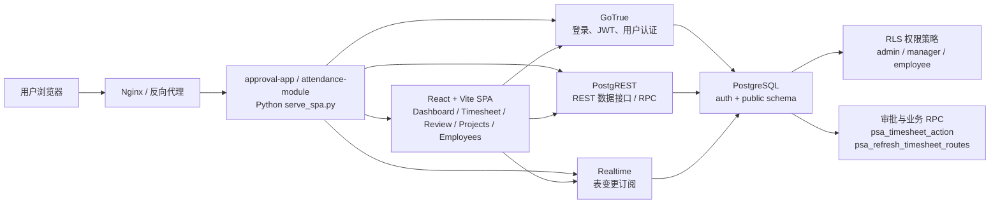

### 运行组件

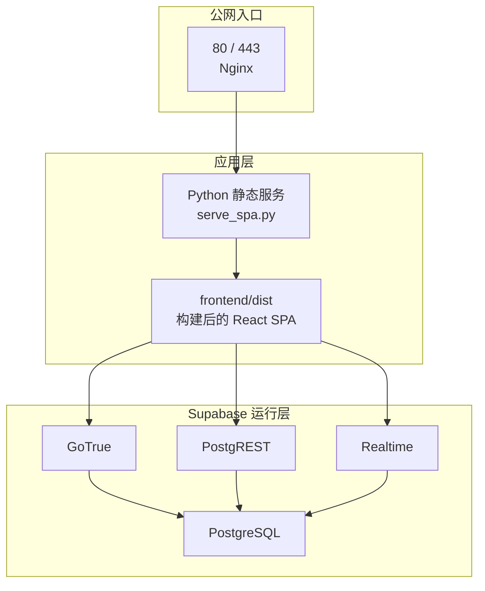

### 当前部署形态

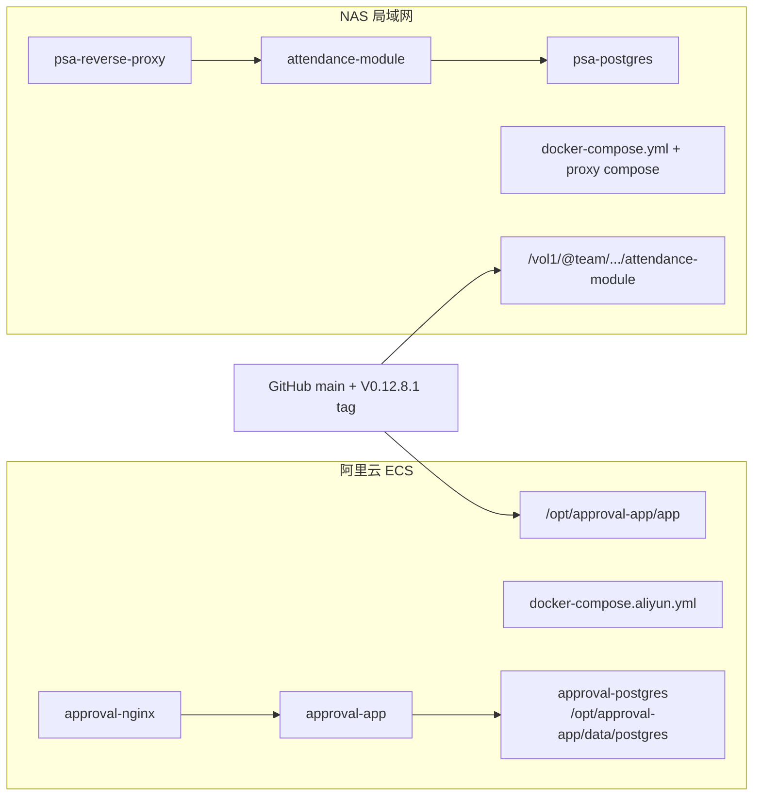

## 2. 前端页面架构

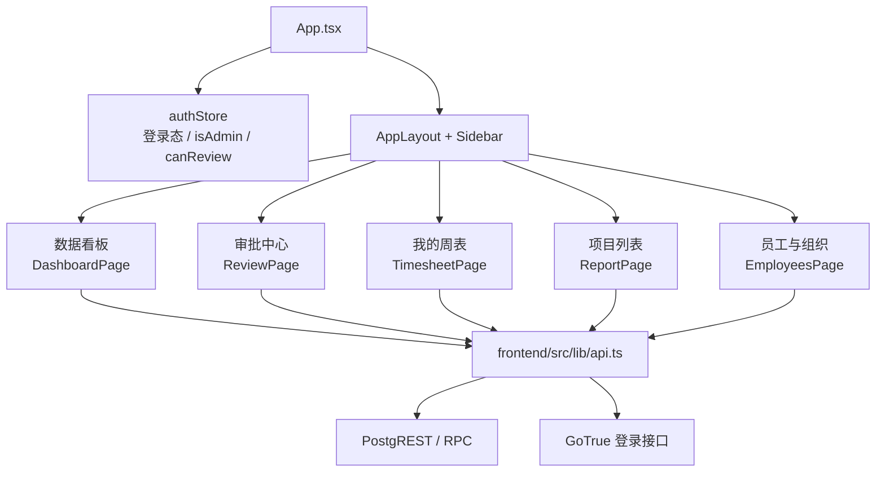

### 前端权限入口

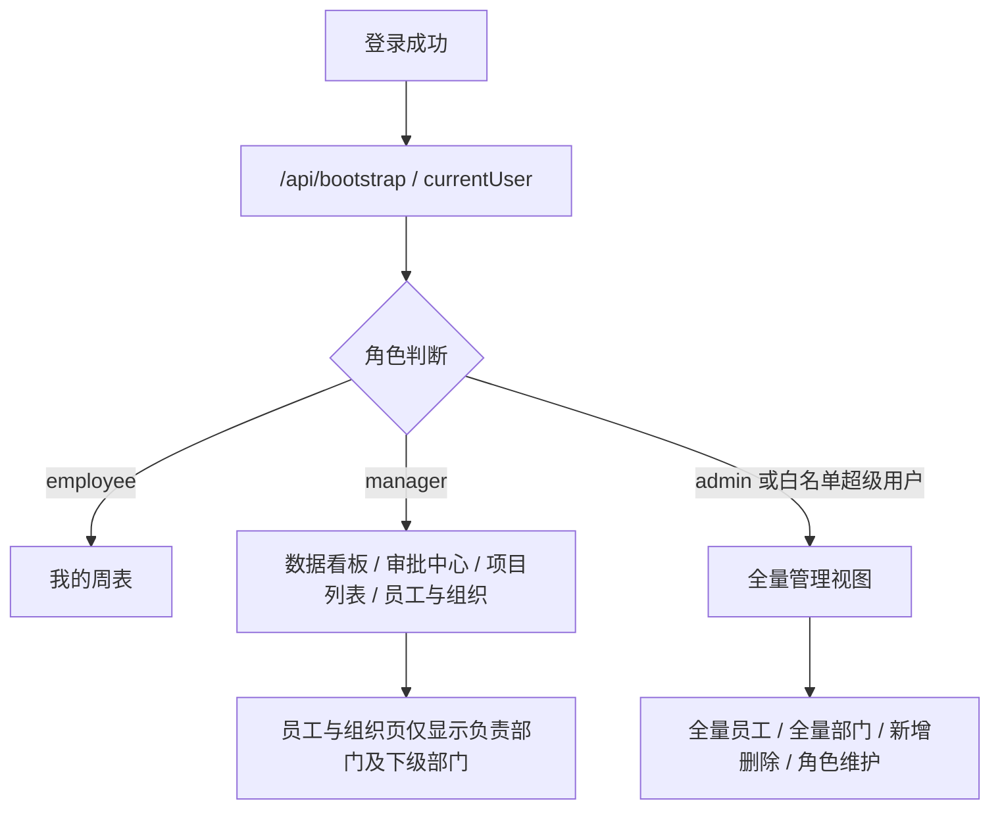

> 说明：当前仍保留历史白名单超级用户规则，`admin` 和白名单用户会在应用层获得 admin 视图。

## 3. 核心数据模型

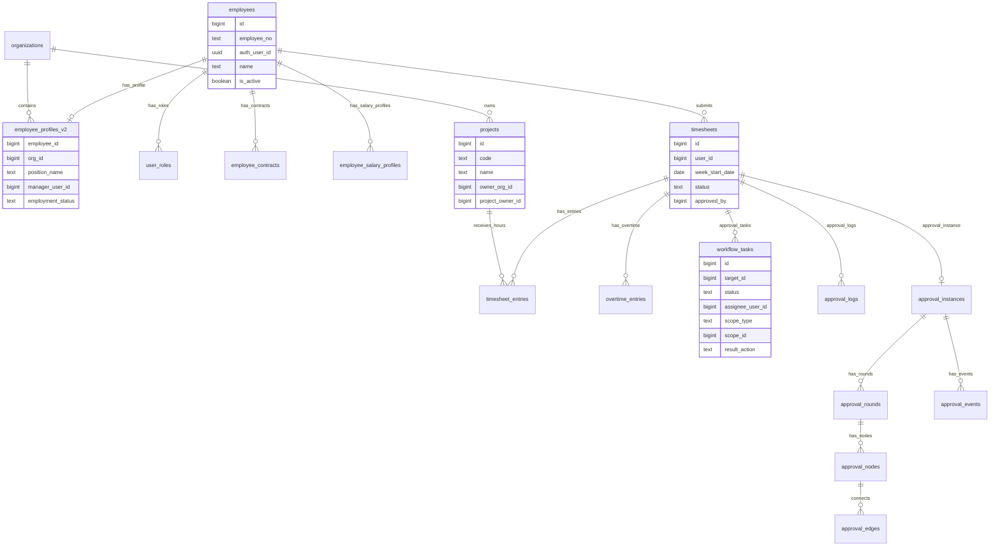

## 4. 周表审批架构

### 审批提交与流转

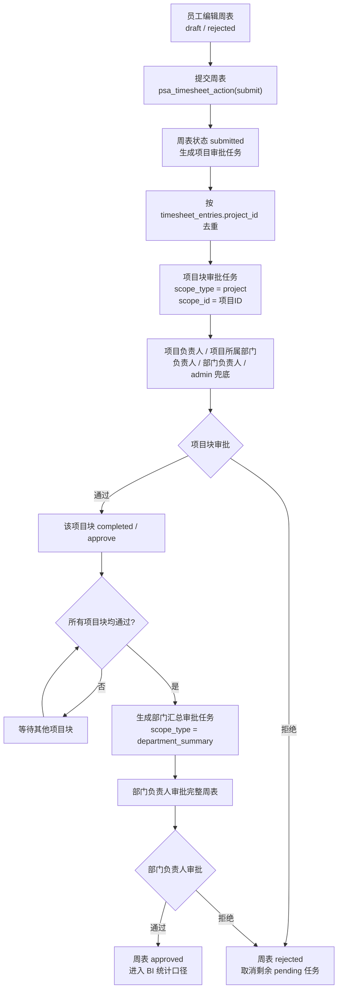

### 审批参与者解析

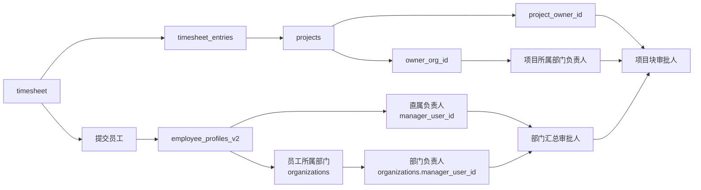

审批人优先级：

- 项目块审批人：项目负责人 `project_owner_id` 优先，其次项目所属部门负责人，再其次提交人部门负责人，最后 admin 兜底。
- 部门汇总审批人：员工直属负责人优先，其次员工所属部门负责人，最后 admin 兜底。
- 如果项目审批人与部门汇总审批人是同一人，系统会做折叠处理，避免同一个人重复审批同一个阶段。

### 审批状态与任务表关系

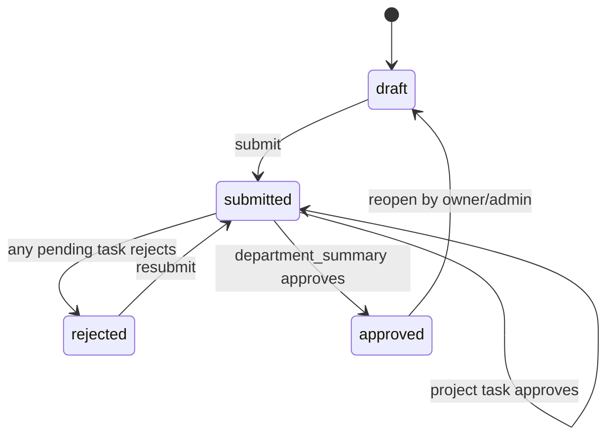

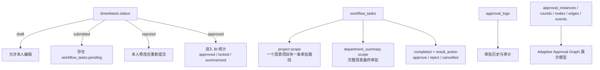

## 5. BI 数据口径

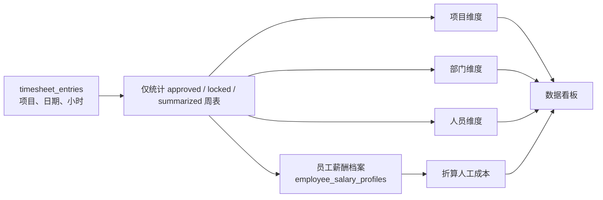

当前 BI 关注：

- 项目维度：项目活跃数、投入工时、人工成本、项目明细。
- 部门维度：部门参与项目数、投入工日、人工成本。
- 人员维度：员工参与项目、分项目工日、人工成本。
- 统计前提：周表必须已经通过或被锁定/汇总，退回和草稿不进入成本统计。

## 6. 权限模型

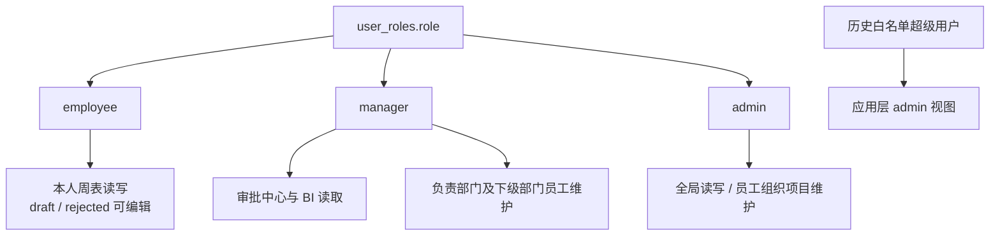

### 员工与组织页当前规则

- admin：看全部员工和全部部门，可以新增/删除员工、维护组织、修改角色。
- 部门负责人：只看自己负责部门及下级部门的员工和部门，可以编辑这些员工的基础信息、合同、薪酬，但不能改系统角色。
- 普通员工：不可进入员工与组织页。
- 历史白名单超级用户：应用层按 admin 视图处理。

## 7. 实时刷新与缓存

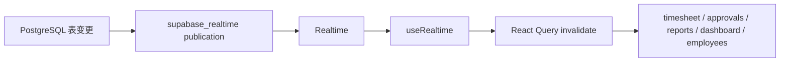

表到前端模块的典型映射：

- `timesheets`：刷新周表、审批、报表、看板。
- `timesheet_entries`：刷新周表、报表、看板。
- `workflow_tasks`：刷新审批和看板。
- `employees` / `employee_profiles_v2` / `organizations`：刷新员工组织、审批、看板。

## 8. 关键文件索引

- 前端入口：`frontend/src/App.tsx`
- 前端 API 兼容层：`frontend/src/lib/api.ts`
- 登录与权限状态：`frontend/src/stores/authStore.ts`
- 员工组织页：`frontend/src/pages/EmployeesPage.tsx`
- 审批中心：`frontend/src/pages/ReviewPage.tsx`
- 周表页：`frontend/src/pages/TimesheetPage.tsx`
- 静态服务与兼容接口：`serve_spa.py`
- 阿里云 compose：`docker-compose.aliyun.yml`
- NAS 运维说明：`nas连接方式.md`
- 基础 schema：`supabase-psa/migrations/001_v0.11_schema.sql`
- 项目块审批：`supabase-psa/migrations/019_timesheet_project_workflow.sql`
- 部门汇总折叠：`supabase-psa/migrations/020_timesheet_summary_collapse.sql`
- 审批路线刷新：`supabase-psa/migrations/021_timesheet_route_refresh.sql`
- Adaptive Approval Graph：`supabase-psa/migrations/023_adaptive_approval_graph.sql`
- 部门负责人维护员工权限：`supabase-psa/migrations/026_department_manager_employee_write.sql`
